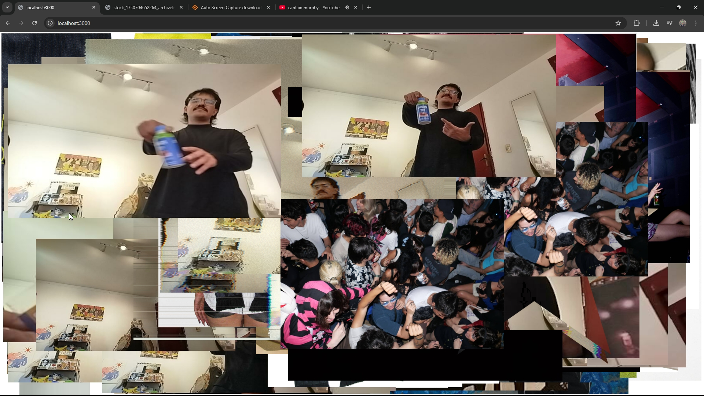

# Live Collage Tool

This is a **Live Collage Tool** that dynamically creates a collage in your browser using a mix of **stock images** and live screenshots from **OBS via OBS WebSocket**. Originally designed for **art installations** and **expo shows**, it offers an engaging, evolving visual experience.

## Features

- Live, browser-based collage display
- Randomly positioned and resized images
- Integration with OBS WebSocket for real-time screenshots
- Occasionally crops or reshapes images for visual variation
- Ideal for interactive exhibitions and creative installations

## Requirements

- [Node.js](https://nodejs.org/)
- [OBS Studio](https://obsproject.com/)
- [OBS WebSocket plugin](https://github.com/obsproject/obs-websocket)

## Getting Started

1. Clone the repository
2. Install dependencies:

   ```bash
   npm install
   ```

3. Ensure OBS and OBS WebSocket are running and properly configured
4. Run the script:

   ```bash
   node server.js
   ```

## Example



## Implementation Ideas

- **Automated Screenshot Capture**: Combine this with scheduled OBS screenshots.
- **Cloud Sync**: Upload images to Google Drive to create a live, shareable gallery where users can download their photos.

## Note

This project was primarily experimental and has served its purpose in past exhibitions. You're welcome to build upon it, customize it, or extend it for your own creative use.